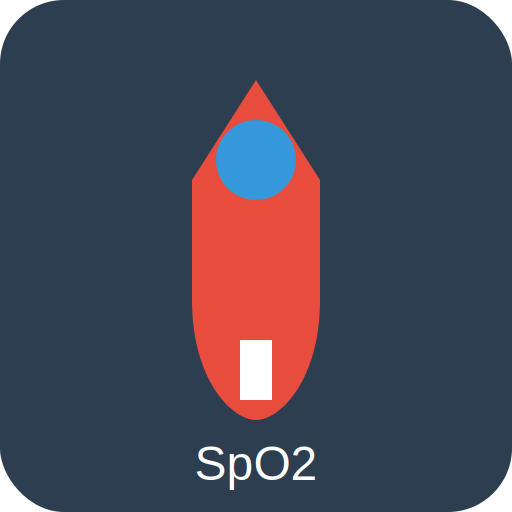
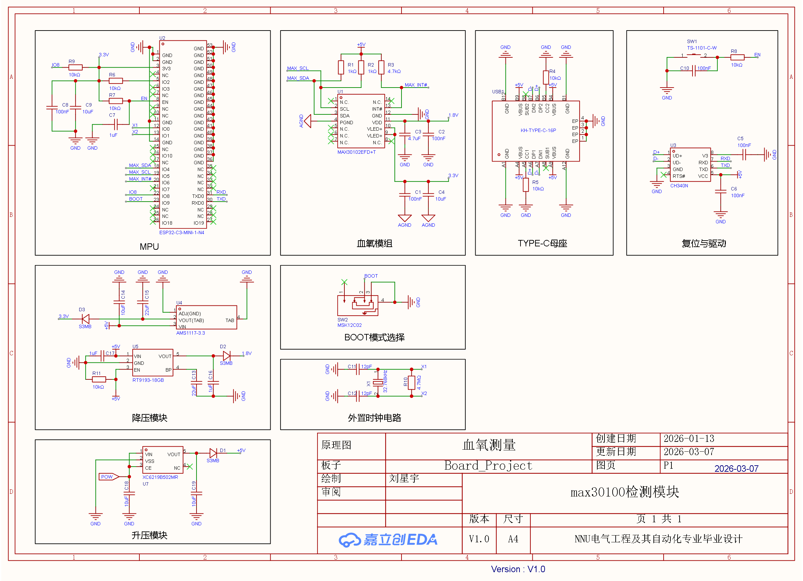

# ESP32 MAX30105/MAX30102 Blood Oxygen Monitor / ESP32 MAX30105/MAX30102 血氧监测仪



English | [中文](#中文)

## English

A blood oxygen saturation (SpO2) monitoring system based on ESP32 and SparkFun MAX30105 sensor.

**Note:** This project also supports MAX30102 sensor, which is pin-compatible with MAX30105 and uses the same library.

### Hardware

- ESP32 Dev Board
- MAX30105 or MAX30102 Sensor Module

### Wiring / 接线

| MAX3010x | ESP32 |
|----------|-------|
| VIN | 3.3V |
| SDA | GPIO 21 (SDA) |
| SCL | GPIO 22 (SCL) |
| GND | GND |



### Build / Build

Use PlatformIO in VSCode:

```bash
# Build only
pio run

# Build and upload
pio run --target upload
```

Or use VSCode PlatformIO extension:
1. Open VSCode
2. Click "Upload" button in PlatformIO toolbar

### Run Monitor / 运行上位机

```bash
# Run source
python src/monitor.py

# Or run compiled executable
dist/血氧监测仪.exe
```

### License / 协议

MIT License - see LICENSE file

---

## 中文

基于 ESP32 和 SparkFun MAX30105 传感器的血氧饱和度 (SpO2) 监测系统。

**注意：** 本项目同样支持 MAX30102 传感器，其与 MAX30105 引脚兼容，使用相同的库。

### 硬件

- ESP32 开发板
- MAX30105 或 MAX30102 传感器模块

### 接线

| MAX3010x | ESP32 |
|----------|-------|
| VIN | 3.3V |
| SDA | GPIO 21 (SDA) |
| SCL | GPIO 22 (SCL) |
| GND | GND |


### 编译

在 VSCode 中使用 PlatformIO：

```bash
# 仅编译
pio run

# 编译并上传
pio run --target upload
```

或使用 VSCode PlatformIO 扩展：
1. 打开 VSCode
2. 点击 PlatformIO 工具栏中的 "Upload" 按钮

### 运行上位机

```bash
# 运行源码
python src/monitor.py

# 或运行编译好的可执行文件
dist/血氧监测仪.exe
```

### 协议

MIT 许可证 - 见 LICENSE 文件
